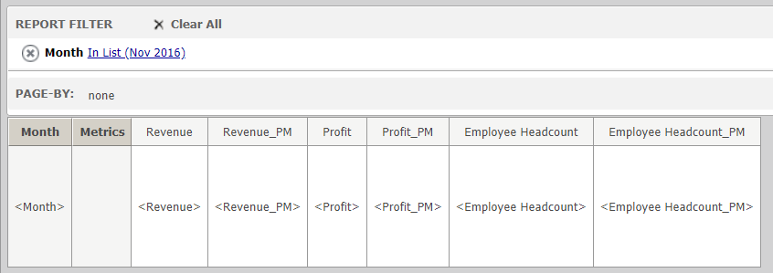

Alexa MicroStrategy Skill using Python
=========================
This is a Python - Flask implementation of an Alexa Skill for getting data from MicroStrategy. 

This code is not for production, is given as an example for this type of integration.

[Demo Video of the skill](https://youtu.be/Qmcc2gxWZiw)

Steps to run
----

* Clone the project.
* Install all dependencies on your python virtual environment.

**MicroStrategy**

* Create a report inside the MicroStrategy Tutorial project with the metrics, Revenue, Profit, Employee Headcount and previous month transformations, change the name of the transformed metrics to metric_PM.

*. Change the values of base_url, mstr_username, mstr_password, project_name, report_id inside the MicroConnect.py file.
* Change the value of login_mode based on the type of authentication used on your MicroStrategy server 1 = Standard, 8 = Anonymus, 16 = LDAP.

**Alexa**
* Create a Custom Skill
* Upload the AlexaSkill.json file to the Interaction Model JSON Editor on Amazons website.
* Edit main.py and change skill_id to the one provided by Amazon.

**For local running**
* Run main.py
* Run ngrok to create a tunnel to localhost
* Update alexa's endpoint to ngrok URL.

[Alexa skill kit documentation](https://developer.amazon.com/en-US/docs/alexa/ask-overviews/build-skills-with-the-alexa-skills-kit.html)